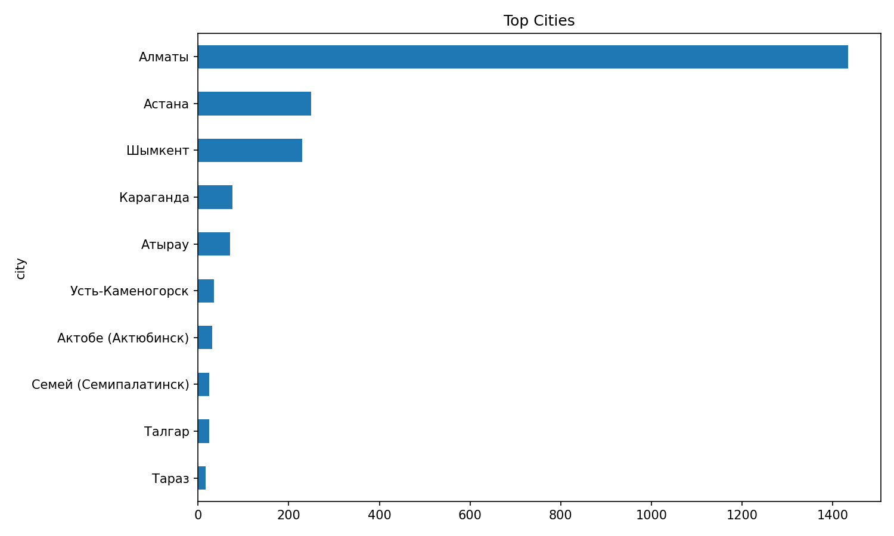
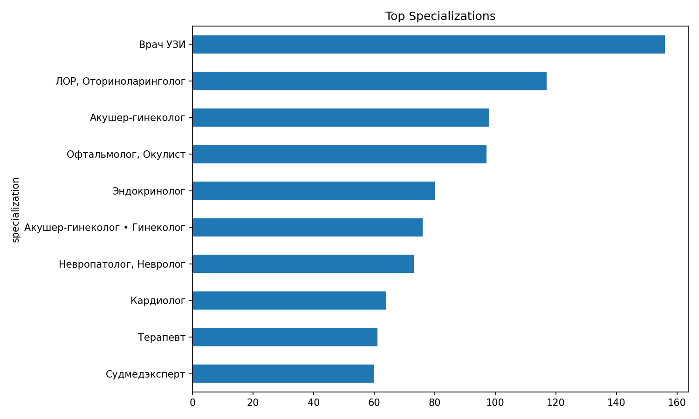
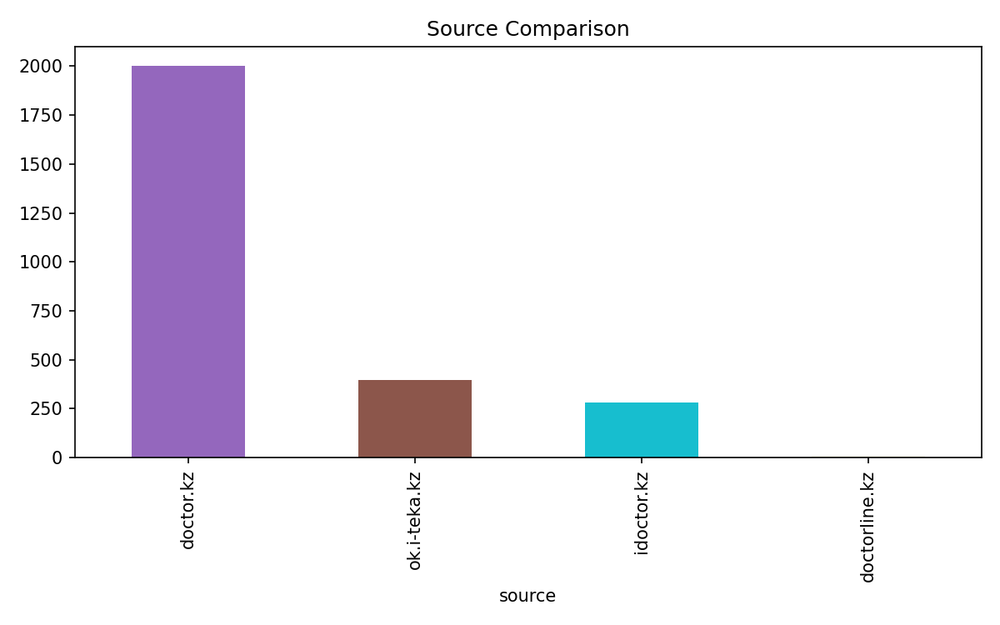
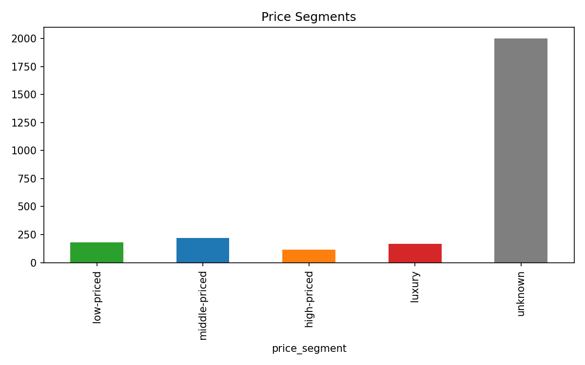
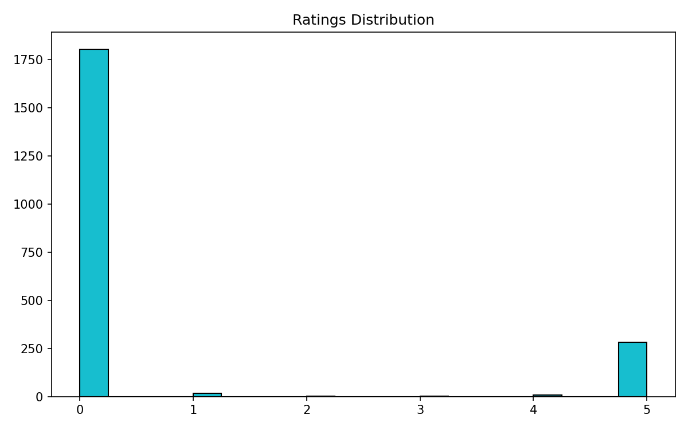
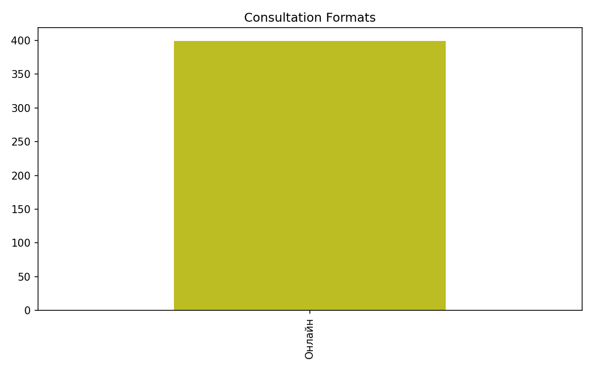

# Online Doctor — Market Intelligence Dataset (Kazakhstan)

> **Assignment 2** | Data-Driven Decision Making | Kuchansky A.  
> Multi-source scraping, data cleaning, and market intelligence analysis of the online telemedicine market in Kazakhstan.

---

## Dataset at a Glance

| Metric | Value |
|---|---|
| **Total records** | **2 680** |
| **Sources** | 4 |
| **Fields per record** | 11 |
| **Target (≥2500)** | ✅ Reached |
| **Price coverage** | 676 records (25%) |
| **Cities covered** | 30+ |
| **Specializations** | 280+ |

---

## Sources

| Source | Records | Key fields available |
|---|---:|---|
| [doctor.kz](https://doctor.kz/doctors) | 2 000 | name, specialization, city, clinic, rating, reviews |
| [ok.i-teka.kz](https://ok.i-teka.kz/doctors) | 395 | name, specialization, **price**, **experience**, consultation_format=Online |
| [idoctor.kz](https://idoctor.kz) | 281 | name, specialization, city, clinic, **rating**, **reviews**, **price** |
| [doctorline.kz](https://doctorline.kz/doctors) | 4 | name, city, consultation_format |

### Excluded sites (with reasons)

| Site | Reason |
|---|---|
| yesmed.kz | HTTP 403 — blocked |
| doq.kz | JS SPA — listing inaccessible without headless browser |
| 103.kz | Captcha / dynamic loading |
| docok.kz | Only 5 public profiles |
| metaclinic.kz | No listing on landing page |
| viamed.kz | No working pagination (47 profiles max) |
| cloudoc.kz | Excluded per assignment constraints |

---

## Data Schema

All sources normalized to **11 fields**:

```
doctor_name        — full name
specialization     — medical specialty
city               — city
clinic             — clinic name
rating             — numeric rating (0–5)
reviews_count      — number of reviews
experience_years   — years of experience
price              — consultation price (KZT)
consultation_format — Online / not specified
source             — data source domain
profile_url        — link to profile page
```

---

## Dashboards

### Top Cities by Doctor Count


Алматы занимает 53.5% рынка. Астана и Шымкент — вторичные центры с ~9% каждый. Остальные города существенно недообслужены.

---

### Top Specializations


Наиболее конкурентные ниши: УЗИ, ЛОР, Акушер-гинеколог, Офтальмолог, Эндокринолог.

---

### Source Comparison


doctor.kz обеспечивает 74.6% датасета. i-teka и idoctor дают цены, рейтинги и структурированные профили.

---

### Price Segments


Ценовые сегменты по данным i-teka и idoctor (676 записей с ценой):
- **low-priced**: ≤ 3 800 KZT  
- **middle-priced**: 3 801–6 400 KZT  
- **high-priced**: 6 401–9 000 KZT  
- **luxury**: > 9 000 KZT

---

### Ratings Distribution


Рейтинги сосредоточены у idoctor.kz (281 запись). Большинство профилей doctor.kz не имеют публичного рейтинга.

---

### Consultation Formats


Явный формат «Онлайн» указан только у i-teka. 85% записей не имеют явного формата — системная проблема прозрачности рынка.

---

## Project Structure

```
assignment3_online_doctor/
│
├── 📊 Data files
│   ├── doctor_kz_doctors.csv              # Source 1: doctor.kz (2000 records)
│   ├── source_ok_i_teka_kz_doctors.csv    # Source 2: i-teka (395 records)
│   ├── source_idoctor_kz_doctors.csv      # Source 3: idoctor.kz (281 records)
│   ├── doctorline_doctors.csv             # Source 4: doctorline.kz (4 records)
│   └── merged_cleaned_dataset.csv         # ✅ Final merged dataset (2680 records)
│
├── 📈 Dashboards (PNG)
│   ├── top_cities.png
│   ├── top_specializations.png
│   ├── source_comparison.png
│   ├── price_segments.png
│   ├── ratings_distribution.png
│   └── consultation_formats.png
│
├── 📝 Reports
│   ├── data_cleaning_report.md            # Cleaning log, missing values, outliers
│   └── market_intelligence_report.md      # SWOT, price segments, strategy
│
├── 📄 Assignment answers
│   ├── assignment2_answer1.txt            # Russian text: data collection & cleaning
│   └── assignment2_answer2.txt            # Russian text: market intelligence
│
├── 🐍 Scripts
│   ├── parse_doctor_kz.py                 # doctor.kz scraper (Assignment 1)
│   ├── analyze_dataset.py                 # EDA script
│   └── assignment2_multi_source_pipeline.py  # Full Assignment 2 pipeline
│
└── 📋 Metadata
    ├── source_site_assessment.json        # Score table for all 9 candidate sites
    └── assignment2_multisource_summary.json
```

---

## How to Run

### Prerequisites

```bash
pip install -r requirements.txt
```

### 1 — Run the full Assignment 2 pipeline (scrape + clean + visualize + report)

```bash
python assignment2_multi_source_pipeline.py
```

This will:
- Assess all 9 candidate sites
- Scrape i-teka (35 specializations × 10 pages) and idoctor (JSON-LD extraction)
- Normalize all sources to the common schema
- Deduplicate and clean the data
- Generate all CSV files, 6 PNG charts, and markdown reports

### 2 — Run only the doctor.kz scraper

```bash
python parse_doctor_kz.py
# or with page limit:
python parse_doctor_kz.py --max-pages 5
```

### 3 — Run EDA on an existing dataset

```bash
python analyze_dataset.py
```

---

## Data Quality Summary

| Field | Coverage |
|---|---|
| doctor_name | 100% |
| specialization | 100% |
| city | 84.6% |
| clinic | 84.6% |
| rating | 79.3% |
| reviews_count | 79.3% |
| experience_years | 20.0% (i-teka only) |
| price | 25.4% (i-teka + idoctor) |
| consultation_format | 14.9% (i-teka only) |

### Outliers (1.5 × IQR method)

| Field | Outliers found | Notes |
|---|---:|---|
| price | 57 | Records > 16 800 KZT — real luxury segment, kept |
| rating | 321 | Q1=Q3=0 on doctor.kz; non-zero values are valid data |
| reviews_count | 322 | Same pattern as rating |
| experience_years | 27 | Doctors with >35 years — legitimate senior specialists |

---

## Key Market Insights

1. **Алматы dominates**: 53.5% of all profiles — highest competition density.
2. **Price transparency gap**: 74.6% of providers don't publish prices publicly.
3. **Middle-priced segment** (3 800–9 000 KZT) is the most promising for a new entrant.
4. **Regional underservice**: Атырау, Усть-Каменогорск, Актобе have very low doctor density relative to population.
5. **Technology gap**: Only idoctor.kz uses structured JSON-LD with machine-readable profiles. Most platforms are static catalogs.

---

## Repository

[https://github.com/almazmurat/assignment3_online_doctor](https://github.com/almazmurat/assignment3_online_doctor)

